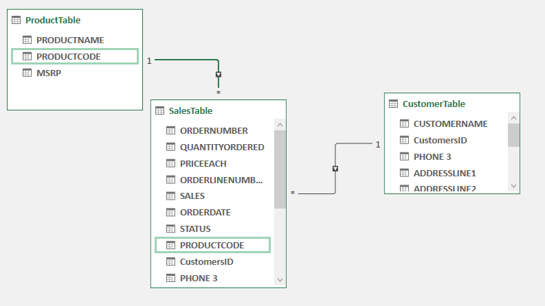

# DBS-SALES-DASHBOARD
The dataset was provided by DBS Motors with the aim of cleaning the data, building a data model, and creating an interactive dashboard using Microsoft Excel.

To achieve this, the dataset was cleaned using various formulas and functions in Excel. Additionally, a few unnecessary columns were removed to prepare the data for modeling.

The dataset was then structured into fact and dimension tables:

Dimension Tables: Product table and Customer table
Fact Table: Sales table
This structured approach was essential for building a robust data model and ensuring meaningful insights could be derived from the dashboard.

### Excel Documentation for Data Cleaning
Changing the phone number to only string
=TEXTJOIN("", TRUE, IF(ISNUMBER(VALUE(MID(A1, ROW(INDIRECT("1:" & LEN(A1))), 1))), MID(A1, ROW(INDIRECT("1:" & LEN(A1))), 1), ""))

Explanation
ROW(INDIRECT("1:" & LEN(A1))): This generates an array of numbers from 1 to the length of the text in cell A1. It's used to create the positions for each character in the text.
MID(A1, ROW(INDIRECT("1:" & LEN(A1))), 1): This extracts one character at a time from the original text in cell A1 based on the positions generated in step 1.
VALUE(...): This attempts to convert each extracted character to a numeric value. If a character is not numeric, it will result in an error.
ISNUMBER(...): This function checks if the conversion in step 3 resulted in a numeric value for each character. It returns TRUE for numeric characters and FALSE for non-numeric characters.
IF(ISNUMBER(VALUE(...)), MID(A1, ROW(INDIRECT("1:" & LEN(A1))), 1), ""): This is an IF statement that replaces non-numeric characters with an empty string.
TEXTJOIN("", TRUE, ...): Finally, the TEXTJOIN function concatenates the filtered numeric characters back into a single text string. The "" between the double quotes is the delimiter (nothing in this case), and TRUE is used to ignore any empty strings in the array.
This formula essentially filters out non-numeric characters from the original text in cell A1, leaving only the numeric characters.
Formatting it correctly by adding the bracket on the 10 digits 
=IF(LEN(R2)=10,TEXT(R2,"(000) 000-0000"),"")

Unique Customer ID - =IF(COUNTIF(I$2:I14,I14)=1,MAX(J$1:J13)+1,VLOOKUP(I14,I$1:J13,2,FALSE))
Components of the Formula
COUNTIF(I$2:I14, I14):
Purpose: Counts the number of times the value in cell I14 appears in the range from I2 to I14.
Usage: This helps in determining whether the current customer ID (I14) is appearing for the first time.
IF(COUNTIF(I$2:I14, I14) = 1, ..., ...):
Purpose: This checks if the value in I14 appears only once in the specified range.
Usage: The condition COUNTIF(I$2:I14, I14) = 1 evaluates to TRUE if I14 appears for the first time. Otherwise, it evaluates to FALSE.

MAX(J$1:J13)+1:
Purpose: Finds the highest value in the range J1 to J13 and adds 1 to it.
Usage: This generates a new unique customer ID by incrementing the highest existing ID by 1.
VLOOKUP(I14, I$1:J13, 2, FALSE):
Purpose: Searches for the value in I14 within the range I1 to J13 and returns the corresponding value from the second column of the range.
Usage: If the customer ID (I14) already exists, this looks up and returns the existing unique customer ID from column J.
Putting It All Together
IF(COUNTIF(I$2:I14, I14) = 1, MAX(J$1:J13)+1, VLOOKUP(I14, I$1:J13, 2, FALSE)):
Condition: COUNTIF(I$2:I14, I14) = 1
If TRUE: It means the customer ID (I14) is new and appears for the first time in the list.
Action: Generate a new unique customer ID by taking the maximum value from column J up to the previous row and adding 1: MAX(J$1:J13) + 1.
If FALSE: It means the customer ID (I14) already exists.
Action: Retrieve the existing unique customer ID using VLOOKUP(I14, I$1:J13, 2, FALSE).

